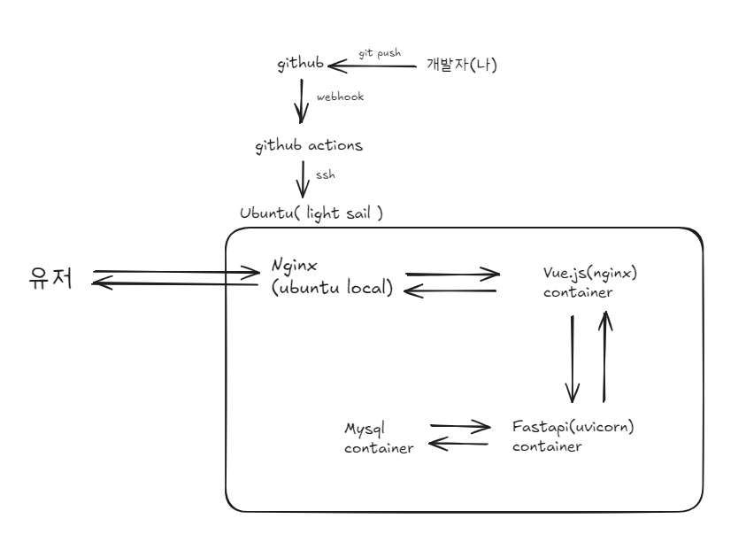
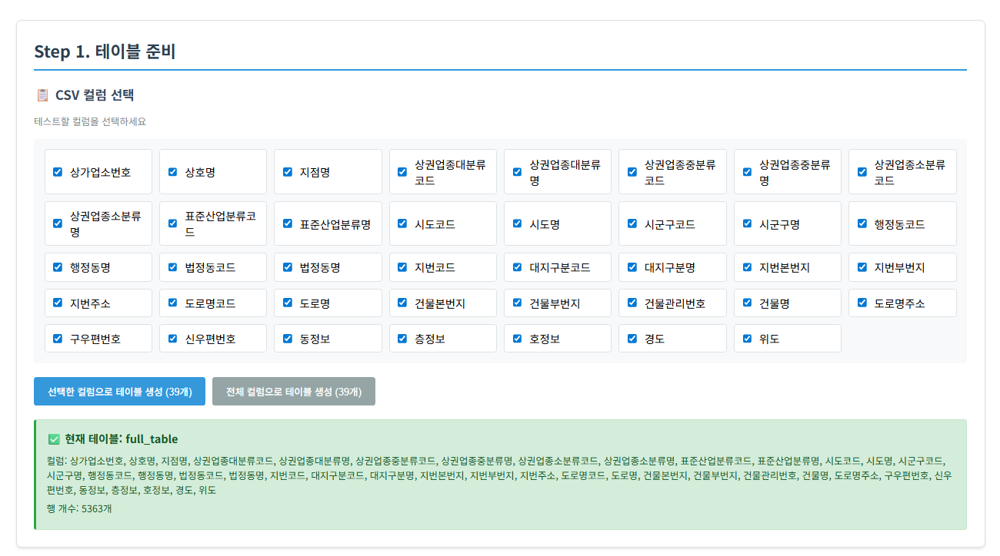
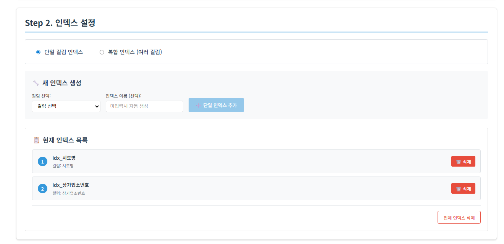
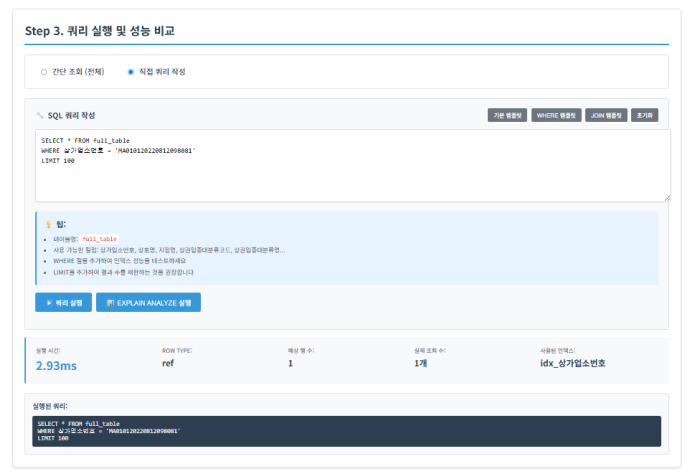
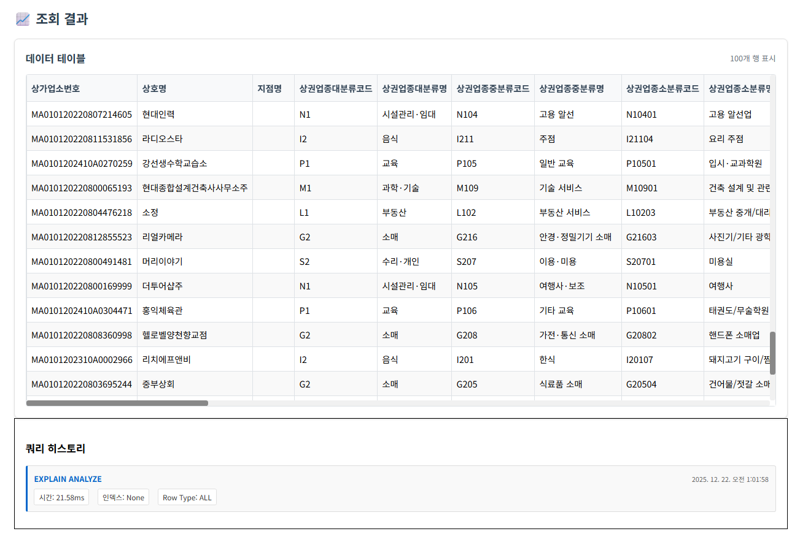

# Market Data
> 공공데이터 포털, 소상공인 데이터를 이용해 인덱스를 테스트해보자!
> 
> **실습 링크** : http://3.39.42.231:8080/

---

## 📌 프로젝트 소개 (About)
소상공인 데이터를 활용한 인덱스 성능 비교 서비스입니다. 
웹 GUI를 통해 인덱스 유무에 따른 실행계획과 쿼리  실행시간을 실시간 비교하며,  SQLP 준비생과 주니어 개발자가  데이터베이스 최적화를 직접 체험할 수 있습니다.

## 프로젝트 진행 기간 / 진행 멤버
2025.12.15 ~ ing / 개인 프로젝트

## ✨ 핵심 기능 (Key Features)
* **기능 1**: 원하는 컬럼을 선택해 단일, 복합 인덱스 생성
* **기능 2**: 쿼리문을 작성하여 쿼리 실행 및 결과 확인
* **기능 3**: 히스토리를 통해 지금까지의 결과 확인

## 🛠 기술 스택 (Tech Stack)
| 분류 | 기술 |
| :--- | :--- |
| **Frontend** | Vue.js |
| **Backend** | Python, FastAPI, SQLAlchemy |
| **DevOps** | AWS Lightsail, Docker, Nginx, Github Actions |
| **Data** | Pandas, 공공데이터 API |

## 시스템 아키텍처

## 서비스 화면

